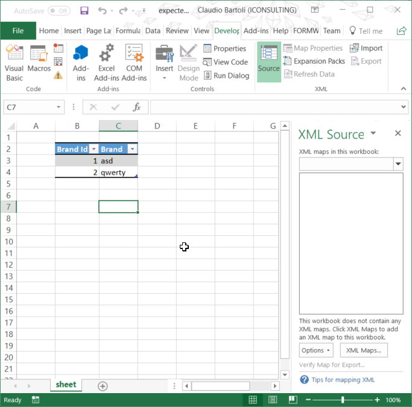
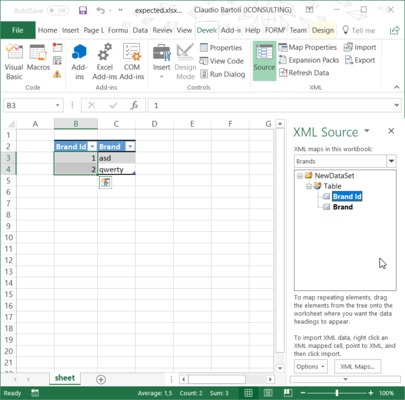

# Repro for issue 90 of Open-XML-SDK

This is reporo steps for [issue #90 of Open-XML-SDK ](https://github.com/OfficeDev/Open-XML-SDK/issues/90)

## How the project works

In assets files, there is an existing xslx file describing brands in a excel table.

Table inside the excel file looks like this:

| Brand id | Brand  |
| -------- | ------ |
|        1 | asd    |
|        2 | qwerty |

The goal of the project is to add xml mapping to that table; it will copy the existing template in the `bin\debug` folder and it will try to add xml mappings.

## Run the project

Running the project it will generate 2 file in `bin\debug` folder:

- actual.xslx
- expected.xlsx

## How to check expectations

I have not found a way to do an automatic check.
At this moment the check has to be done opening the file with excel.

Steps:
 - Open Micrososft Excel
 - Enable Developer Ribbon Tab
 - Toggle `Source` button on XML Section

| Actual | Expected |
| ------ | -------- |
| XML Source on the sidebar apprears empty | XML Source on the sidebar should be not blank |
|  |  |

